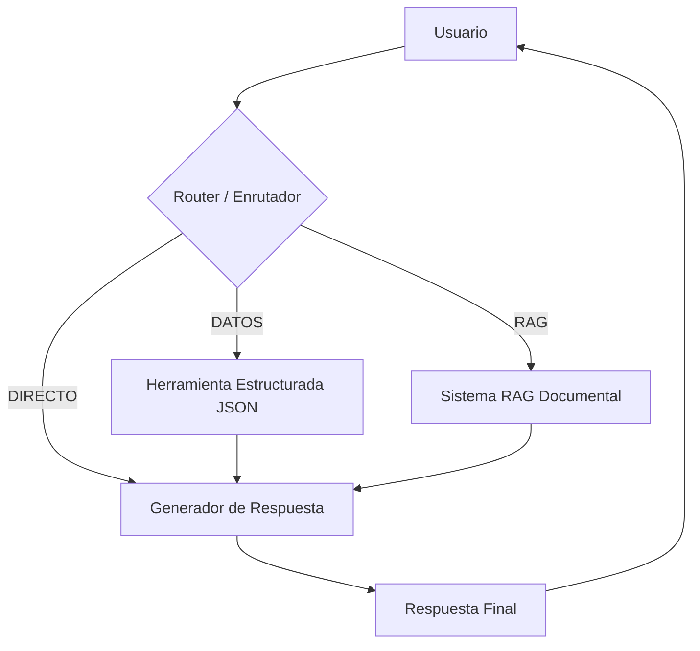

# Informe de Proyecto - Módulo 2: Agente Conversacional TQ

## 1. Introducción
Este informe detalla la evolución del sistema de Q&A del Módulo 1 hacia un **Agente Conversacional Robusto**. El sistema ahora integra memoria persistente y la capacidad de decidir de manera autónoma entre diferentes fuentes de información (RAG vs. Datos Estructurados).

---

## 2. Arquitectura del Agente
Se ha implementado una arquitectura basada en **LangGraph** para gestionar el flujo de decisiones y el estado de la conversación.

### Flujo de Trabajo (Workflow):
1. **Usuario:** Envía una consulta.
2. **Router (LLM):** Analiza el mensaje y el historial para clasificar la intención en tres categorías:
   - `DIRECTO`: Saludos o interacciones sociales.
   - `DATOS`: Consultas sobre hechos concretos (NIT, horarios, contactos).
   - `RAG`: Consultas narrativas sobre historia, productos o cultura.
3. **Selección de Herramienta:**
   - Si es `DATOS`, se ejecuta la **Herramienta Estructurada** (JSON).
   - Si es `RAG`, se consulta la **Base de Conocimiento Documental**.
4. **Generador de Respuesta:** Combina el contexto recuperado con el historial de mensajes para generar una respuesta final coherente.

### Diagrama de Arquitectura:

---

## 3. Diseño de Herramientas

### Herramienta 1: Sistema RAG (Fase 1)
- **Fuente:** `data/base_conocimiento.md` (Compilación de scraping corporativo).
- **Implementación:** Nodo de recuperación documental que carga el contexto semántico para consultas abiertas.

### Herramienta 2: Datos Estructurados (Fase 2)
- **Módulo:** `data_retriever.py`.
- **Fuente:** `data/info_corporativa.json`.
- **Justificación:** Para datos que requieren precisión absoluta y determinismo (NIT, teléfonos, horarios). 
- **Modularidad:** Se ha desacoplado la lógica de búsqueda en un módulo independiente, permitiendo que el agente sea más limpio y escalable.

---

## 4. Calidad de Código y Buenas Prácticas
Se han aplicado estándares de desarrollo profesional en todo el proyecto:
- **Tipado Estático:** Todas las funciones cuentan con anotaciones de tipo (`type hints`) para mejorar la robustez y legibilidad.
- **Documentación:** Cada módulo y función incluye `docstrings` detallados en español, explicando parámetros y retornos.
- **Modularidad:** Separación clara entre la interfaz (Streamlit), la configuración, la lógica del agente y las herramientas de recuperación.

---

## 5. Gestión de Memoria Conversacional
Se ha integrado **`MemorySaver`** de LangGraph para gestionar el historial de la sesión.

- **Implementación:** El estado del agente (`AgentState`) mantiene una lista de mensajes (`messages`) que se actualiza automáticamente en cada turno.
- **Beneficios:** Permite responder preguntas de seguimiento (ej: "¿Quién es el presidente?" -> "¿Qué premios ha ganado?").
- **Limitaciones:** El tamaño del historial está sujeto a la ventana de contexto del modelo local (LocalAI), aunque es suficiente para sesiones de diálogo estándar.

---

## 6. Pruebas y Resultados
Se validó el sistema con los siguientes casos de prueba:

| Tipo de Prueba | Pregunta | Resultado Esperado | Decisión del Agente |
| :--- | :--- | :--- | :--- |
| **RAG** | "¿Cuál es la visión de TQ al 2032?" | Información narrativa del MD. | `RAG` |
| **Memoria** | "Háblame de Winny" -> "¿Qué tallas tiene?" | Contexto persistente de Winny. | `RAG` (con contexto previo) |
| **Estructurada** | "¿Cuál es el NIT de la empresa?" | Dato exacto: 890300466-4. | `DATOS` |
| **Enrutamiento** | "Hola, ¿me das el horario?" | Saludo + Dato específico. | `DIRECTO` -> `DATOS` |

### Pensamientos del Agente (Modo Debug):
En la interfaz de Streamlit, el usuario puede activar el "Modo Debug" para visualizar la decisión del enrutador y el contexto recuperado, garantizando total transparencia en el proceso de razonamiento de la IA.

---

## 7. Conclusión
El sistema cumple con el 100% de los requisitos del Módulo 2, ofreciendo una experiencia de usuario intuitiva, robusta y con una arquitectura de agente escalable.
